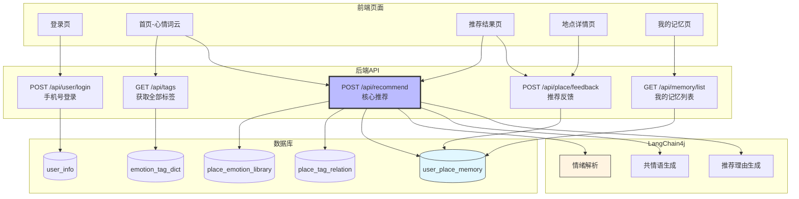
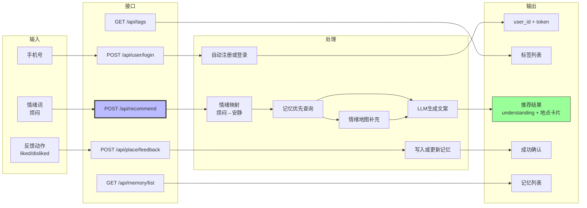
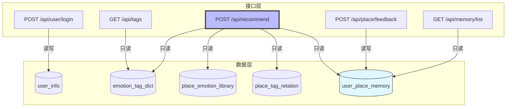

## 接口设计原则
1. RESTful 风格，但以实用为主

2. 统一响应格式：{ "code": 200, "message": "success", "data": {} }

3. 认证方式：登录后返回 JWT Token，后续请求放 Header：Authorization: Bearer <token>

4. 字段命名：统一用下划线（snake_case）

5. Demo策略：手机号快捷登录，不做密码验证


## 统一响应格式
```json
{
  "code": 200,
  "message": "success",
  "data": {}
}
```

## 接口图一浏览
**接口整体架构**

**接口数据流图**


**接口-数据库对应关系图**

## 接口详细设计
### 接口1：手机号登录
路径：POST /api/user/login

请求：

```json
{
  "phone": "13800138001"
}
```
响应：

```json
{
  "code": 200,
  "data": {
    "user_id": 1,
    "nickname": "小明",
    "token": "xxx"
  }
}
```
逻辑：查 user_info，有则返回，无则自动注册。

### 接口2：获取全部标签
路径：GET /api/tags

说明：前端加载词云用，不需要登录。

响应：

```json
{
  "code": 200,
  "data": {
    "tags": [
      { "id": 1, "tag_name": "安静", "category": "氛围" },
      { "id": 11, "tag_name": "发呆", "category": "功能" }
    ]
  }
}
```
SQL：SELECT * FROM emotion_tag_dict ORDER BY category, id

### 接口3：核心推荐
路径：POST /api/recommend

说明：需登录，Header 带 Authorization: Bearer <token>

请求：

```json
{
  "mood": "烦闷",
  "energy_level": 3,//前端可选是否传
  "social_level": 2,//前端可选是否传
  "user_input": null,
  "user_lat": 22.5431,
  "user_lng": 113.9526
}
```
响应：

```json
{
  "code": 200,
  "data": {
    "understanding": "懂了，你需要安静地待一会儿",
    "memory_matches": [
      {
        "place_id": 1,
        "place_name": "沙河公园湖边长椅",
        "address": "南山区沙河西路",
        "mood_tags": ["安静","放空","独处"],
        "crowd_level": "低",
        "one_sentence": "下午三点有阳光，通常没人",
        "image_url": "/images/place/shahe_changyi.jpg",
        "distance_text": "距你1.2公里",
        "match_type": "visited",
        "match_reason": "你上次说真的很放松",
        "last_visited": "2026-03-15"
      }
    ],
    "emotion_matches": [ ... ]
  }
}
```
后端逻辑：

1. Token 解析 user_id
2. 如果 mood 和 atmosphere 为空，调 LLM 解析 mood、atmosphere
3. 调 LLM 生成 understanding
4. 用 atmosphere 查 emotion_tag_dict 获取 tag_id
5. 先查 user_place_memory（记忆优先）
6. 不够 3 条再查 place_emotion_library + place_tag_relation（情绪地图）
7. 调 LLM 生成 match_reason
8. 计算距离，返回

### 接口4：推荐反馈
路径：POST /api/place/feedback

说明：需登录。

请求：

```json
{
  "place_id": 1,
  "action": "liked",
  "feedback": "真的很放松",
  "rating": 5
}
```
action 值	对应 interaction_type
liked	BOOKMARKED
disliked	DISLIKED
visited	VISITED
响应：

```json
{
  "code": 200,
  "message": "success"
}
```
逻辑：写入或更新 user_place_memory。

### 接口5：我的记忆列表
路径：GET /api/memory/list?type=visited

说明：需登录。

请求参数：

|参数|	必填|	说明|
|---|---|---|
type|	否	|visited / bookmarked，不传返回全部

响应：

```json
{
  "code": 200,
  "data": {
    "list": [
      {
        "memory_id": 1,
        "place_id": 1,
        "place_name": "沙河公园湖边长椅",
        "image_url": "/images/place/shahe_changyi.jpg",
        "interaction_type": "VISITED",
        "rating": 5,
        "feedback": "真的很放松",
        "visited_at": "2026-03-15"
      }
    ]
  }
}
```
SQL：SELECT * FROM user_place_memory WHERE user_id = ?

### 接口6：地点详情
路径：GET /api/place/detail/{place_id}

说明：需登录。

响应：

```json
{
  "code": 200,
  "data": {
    "place_id": 1,
    "place_name": "沙河公园湖边长椅",
    "address": "南山区沙河西路",
    "latitude": 22.5532,
    "longitude": 113.9456,
    "mood_tags": ["安静","放空","独处"],
    "crowd_level": "低",
    "best_time": "工作日下午",
    "one_sentence": "下午三点有阳光，通常没人",
    "full_description": "位于沙河公园北侧湖边...",
    "image_url": "/images/place/shahe_changyi.jpg",
    "tips": "蚊虫较多，建议带驱蚊水",
    "your_history": {
      "has_visited": true,
      "visit_count": 2,
      "last_visited": "2026-03-15",
      "your_rating": 5,
      "your_feedback": "真的很放松"
    }
  }
}
```


```sql
-- 地点信息
SELECT * FROM place_emotion_library WHERE id = ?;
-- 标签
SELECT etd.tag_name FROM place_tag_relation ptr 
JOIN emotion_tag_dict etd ON ptr.tag_id = etd.id 
WHERE ptr.place_id = ?;
-- 当前用户对该地点的历史
SELECT * FROM user_place_memory WHERE user_id = ? AND place_id = ?;
```